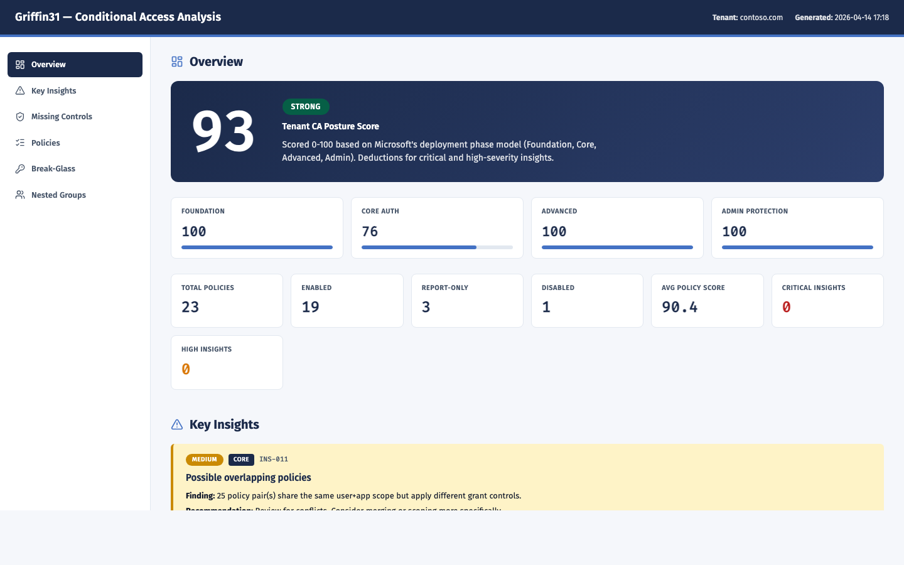

# CA-Policy-Analyzer

> **Conditional Access posture score, policy gaps, and priority-sorted insights** — single self-contained HTML report.

<sub>[← Back to Griffin31 ToolKit](../) · Cross-platform (Windows · macOS · Linux) · PowerShell 7</sub>

<p align="center">
  
</p>

---

## What you get

- **Tenant posture score** (0-100) mapped to Microsoft's 3-phase deployment model
- **15 priority-sorted key insights** — lockout risk, break-glass, legacy auth, weak MFA, admin protection, guest coverage, May-2026 enforcement, overlaps, stale policies
- **23 modern CA controls** checked against your tenant with license badges (P1 / P2 / Purview / WID)
- **Per-policy scoring** with deductions for weak MFA, broad exclusions, single-user/single-app targeting, platform gaps, location bypass
- **Direct Entra portal deep-links** per policy

Validated against Microsoft Learn (April 2026).

## Quick start

```powershell
pwsh ./CA-Manager.ps1
```

Menu options: (1) Export only — (2) Analyze existing export — (3) Full pipeline.

## Why this tool?

Conditional Access is the front door to your tenant — but most admins can't tell at a glance whether policies actually cover everyone, whether exclusions are safe, or whether they're missing modern controls like phishing-resistant MFA, token protection, or risk-based policies. This tool exports your full CA configuration, scores every policy, flags tenant-wide gaps against Microsoft's 2026 best practices, and produces a single HTML report an admin can scan in under a minute.

## Requirements

- PowerShell 7.x (Windows or macOS)
- `Microsoft.Graph` module — auto-installs if missing (pinned to consistent version to avoid submodule conflicts)
- Permissions: `Policy.Read.All`, `Directory.Read.All`, `Group.Read.All`, `Application.Read.All`

## How it works

The pipeline runs six stages, each writing JSON to `tenants/<domain>/data/`:

1. **Export-Data** — pulls policies, users, guests, groups (incl. nested memberships), service principals, named locations, directory roles
2. **Detect-BreakGlass** — identifies accounts excluded from all enabled policies (emergency access)
3. **Analyze-NestedGroups** — resolves nested group membership so exclusions are counted correctly
4. **Analyze-PolicyGaps** — scores every policy 0-100
5. **Analyze-MissingControls** — checks against 23 modern CA controls, each tagged with required license
6. **Analyze-KeyInsights** — 15 priority-sorted checks + tenant posture score

**Generate-Report** assembles the final HTML with sticky sidebar, posture score hero, phase coverage bars, priority-sorted insight cards, missing-controls grouped by license, and a full policy table (DataTables — sort/filter/search).

## License badges

Not every recommended control ships with every SKU. Each missing control is tagged:

- **P1** — Entra ID P1 (most controls)
- **P2** — Entra ID P2 (risk-based sign-in, risk-based user, AI agent policies)
- **Purview** — Microsoft Purview (insider risk signals)
- **WID** — Workload Identities (service principal CA)

## Output

- `tenants/<domain>/data/` — JSON exports and analysis output (one file per stage)
- `tenants/<domain>/reports/CA_Gap_Analysis_<timestamp>.html` — the final report

Report is self-contained — open in any browser, share as a file. CDN assets (fonts, DataTables) load from pinned versions with SRI hashes.

## Related tools

- [CA-Update-AffectedApps](../CA-Update-AffectedApps/) — zoom in on the May 2026 enforcement change
- [SharePoint-Sites-Audit](../SharePoint-Sites-Audit/) — companion posture report for SharePoint entities
