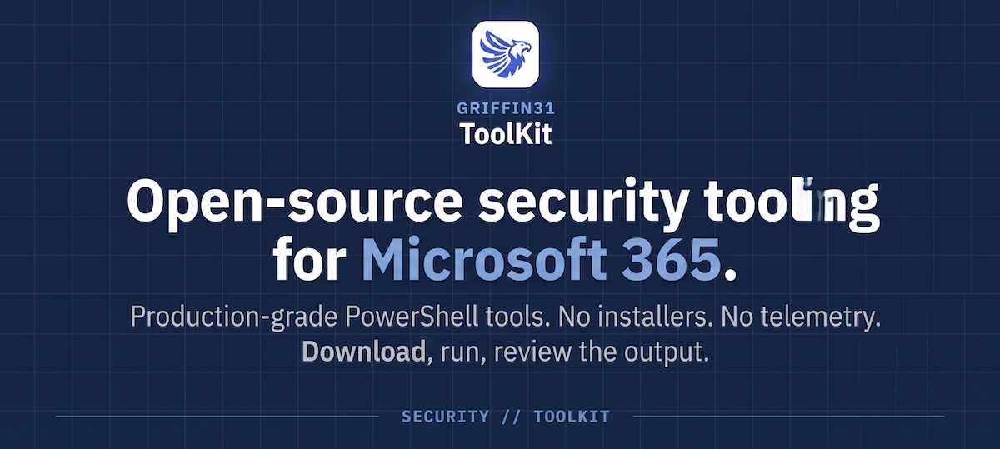

<div align="center">

<a href="https://www.griffin31.com">
  
</a>

<p>
  Built by security engineers, for security engineers. Production-grade PowerShell tools<br/>
  that complement the <a href="https://www.griffin31.com"><strong>Griffin31</strong></a> posture-management platform.
</p>

<p>
  <a href="https://github.com/griffin31-lab/Griffin31-ToolKit/stargazers"></a>
  
  <a href="https://github.com/griffin31-lab/Griffin31-ToolKit/blob/main/LICENSE"></a>
  
</p>

<p>
  <a href="https://www.griffin31.com"><strong>Website</strong></a> &nbsp;·&nbsp;
  <a href="https://github.com/griffin31-lab/Griffin31-ToolKit/discussions"><strong>Discussions</strong></a> &nbsp;·&nbsp;
  <a href="https://github.com/griffin31-lab/Griffin31-ToolKit/issues"><strong>Report an Issue</strong></a> &nbsp;·&nbsp;
  <a href="SECURITY.md"><strong>Security</strong></a>
</p>

</div>

---

<details>
<summary><strong>Table of contents</strong></summary>

- [Why Griffin31 ToolKit?](#why-griffin31-toolkit)
- [Which tool do I need?](#which-tool-do-i-need)
- [The tools](#the-tools)
  - [Conditional Access](#-conditional-access)
  - [Identity & Access](#-identity--access)
  - [Data & Collaboration](#-data--collaboration)
  - [Email Security](#-email-security)
- [Getting started](#getting-started)
- [Design principles](#design-principles)
- [Security](#security)
- [Contributing](#contributing)
- [About Griffin31](#about-griffin31)

</details>

---

## Why Griffin31 ToolKit?

Microsoft 365 and Entra ID are the modern enterprise's front door — and the most frequent target. Built-in tooling doesn't cover every corner: stale devices, over-permissioned apps, expiring credentials, Conditional Access blind spots, SPF misconfigurations, SharePoint oversharing, Exchange permission sprawl.

The ToolKit is a **focused set of production-grade scripts** — each one solves a single real problem we hit in the field. No installers, no cloud back-end, no telemetry. Download, run, review the output.

Used internally at Griffin31 against real customer tenants, published here for the community.

<p align="center">
  <a href="CA-Policy-Analyzer/"></a>
  <br/>
  <sub>Example: CA-Policy-Analyzer HTML report (anonymized). Each tool produces either an interactive HTML report, a formatted Excel workbook, or a console audit.</sub>
</p>

<table>
<tr>
<td width="33%" valign="top" align="center">

#### One problem, one tool

Every script solves a single real, high-frequency problem. No frameworks you don't need.

</td>
<td width="33%" valign="top" align="center">

#### Safe by default

Read-only by default. Destructive actions require explicit confirmation. Break-glass logic baked in.

</td>
<td width="33%" valign="top" align="center">

#### Honest output

Reports show what the tool can and cannot determine. No inflated scores, no marketing numbers.

</td>
</tr>
</table>

---

## Which tool do I need?

| If you want to… | Use | Output |
|---|---|---|
| Audit your Conditional Access policies + posture score | [CA-Policy-Analyzer](CA-Policy-Analyzer/) ★ | HTML report |
| Prepare for the May 2026 CA enforcement change | [CA-Update-AffectedApps](CA-Update-AffectedApps/) | Excel risk report |
| Find sites, OneDrives, Teams with public sharing or missing labels | [SharePoint-Sites-Audit](SharePoint-Sites-Audit/) ★ | HTML report |
| Clean up stale devices | [Entra-StaleDevices-Cleanup](Entra-StaleDevices-Cleanup/) | Excel + actions |
| Clean up unused app registrations | [Entra-StaleApps-Cleanup](Entra-StaleApps-Cleanup/) | Excel + actions |
| Catch expiring app credentials before they break production | [Entra-AppCredentials-Audit](Entra-AppCredentials-Audit/) | Excel |
| Scope Exchange Online app permissions to specific mailboxes | [EXO-AppPermissions-Manager](EXO-AppPermissions-Manager/) | Interactive |
| Validate an SPF record against the 10-lookup RFC limit | [SPF-Lookup-Validator](SPF-Lookup-Validator/) | Console |

★ = flagship tool with rich HTML report

---

## The tools

### 🛡️ Conditional Access

<table>
<tr>
<td width="50%" valign="top">

#### [CA-Policy-Analyzer](CA-Policy-Analyzer/) ★

**CA posture score, gaps, and insights**

Exports your full CA configuration, scores every policy 0-100, flags tenant-wide gaps against Microsoft's 2026 best practices — including the May 2026 enforcement change — and produces a self-contained HTML report with posture score, priority-sorted insights, and per-policy drill-down.

`Conditional Access` · `Entra ID` · `Posture` · `Zero Trust`

</td>
<td width="50%" valign="top">

#### [CA-Update-AffectedApps](CA-Update-AffectedApps/)

**Prepare for Microsoft's May 2026 CA change**

Identifies tenant apps using basic OIDC scopes, cross-references sign-in logs for MFA status, and generates an Excel risk report so you can remediate before the change breaks authentication.

`Conditional Access` · `App Assessment` · `MFA`

</td>
</tr>
</table>

### 👤 Identity & Access

<table>
<tr>
<td width="50%" valign="top">

#### [Entra-AppCredentials-Audit](Entra-AppCredentials-Audit/)

**Catch expiring app credentials**

Scans every app registration, flags expired and soon-to-expire certificates and client secrets, resolves owners, and optionally removes expired credentials. Excel report with direct links into the Entra portal.

`Entra ID` · `App Registrations` · `Credential Hygiene`

</td>
<td width="50%" valign="top">

#### [Entra-StaleApps-Cleanup](Entra-StaleApps-Cleanup/)

**Clean up unused app registrations**

Every tenant accumulates unused app registrations — each one a credential exposure and a permission-abuse risk. Queries the Graph sign-in activity report, flags apps idle past your threshold, and lets you disable or delete them safely.

`Entra ID` · `App Registrations` · `Cleanup`

</td>
</tr>
<tr>
<td width="50%" valign="top">

#### [Entra-StaleDevices-Cleanup](Entra-StaleDevices-Cleanup/)

**Audit, disable, or delete stale devices**

Finds devices that haven't signed in for X days, filters by OS and ownership, shows a full audit with MDM info, then gives you the decision — export only, disable, or delete.

`Entra ID` · `Device Management` · `Compliance`

</td>
<td width="50%" valign="top">

&nbsp;

</td>
</tr>
</table>

### 📄 Data & Collaboration

<table>
<tr>
<td width="50%" valign="top">

#### [SharePoint-Sites-Audit](SharePoint-Sites-Audit/) ★

**Find the risky sites, OneDrives, groups, teams**

Iterates every site, OneDrive, M365 group, and Team. Runs 14 per-entity security checks — public sharing, excessive external users, inactive sites, missing sensitivity labels — and produces an HTML report with per-entity scores and drill-down findings.

`SharePoint` · `OneDrive` · `Teams` · `Sensitivity Labels`

</td>
<td width="50%" valign="top">

#### [EXO-AppPermissions-Manager](EXO-AppPermissions-Manager/)

**Exchange Online app-to-mailbox scoping**

Creates management scopes, assigns roles, and verifies configuration in one flow. Supports all 13 Exchange application roles and every mailbox type.

`Exchange Online` · `RBAC` · `Mailbox Scoping`

</td>
</tr>
</table>

### 📧 Email Security

<table>
<tr>
<td width="100%" valign="top">

#### [SPF-Lookup-Validator](SPF-Lookup-Validator/)

**RFC 7208-compliant SPF chain analysis**

Recursively walks your entire SPF include chain, counts the real DNS lookup total against the 10-lookup limit, and catches misconfigurations before they break email delivery.

`SPF` · `Email Security` · `DNS`

</td>
</tr>
</table>

---

## Getting started

```powershell
# Clone the repository
git clone https://github.com/griffin31-lab/Griffin31-ToolKit.git
cd Griffin31-ToolKit

# Pick a tool, open its folder, follow its README
cd CA-Policy-Analyzer
pwsh ./CA-Manager.ps1
```

Every tool is self-contained. Most tools require:

- **PowerShell 7.x** — [install guide](https://aka.ms/install-powershell)
- **Microsoft.Graph module** — auto-installs on first run
- **Delegated admin permissions** — each tool's README lists exact scopes

No Griffin31 account needed. No telemetry. No network calls outside Microsoft Graph.

---

## Design principles

- **One problem, one tool** — Every script solves a single real, high-frequency problem. No frameworks you don't need.
- **Safe by default** — Read-only by default. Destructive actions require explicit confirmation (often two-stage).
- **Honest output** — Reports show what the tool can and cannot determine. No inflated scores, no marketing numbers.
- **Self-contained** — Copy the folder, run it, delete it. No global state, no installers.
- **Cross-platform where possible** — PowerShell 7 on Windows and macOS. We note when a tool is Windows-only.

---

## Security

Found a vulnerability? Please follow our [security policy](SECURITY.md) — responsible disclosure to **security@griffin31.ai**. We respond within 48 hours.

All tools are scanned for supply-chain risks and reviewed against OWASP and Microsoft Graph least-privilege guidance before release. CDN dependencies in generated HTML reports are pinned with SRI hashes.

---

## Contributing

We welcome contributions — bug fixes, new tools, documentation improvements.

- **Issues** — [open a ticket](https://github.com/griffin31-lab/Griffin31-ToolKit/issues) for bugs and feature requests
- **Discussions** — [join the conversation](https://github.com/griffin31-lab/Griffin31-ToolKit/discussions)
- **Contribution guide** — see [CONTRIBUTING.md](CONTRIBUTING.md)
- **Code of conduct** — see [CODE_OF_CONDUCT.md](CODE_OF_CONDUCT.md)

---

## About Griffin31

[Griffin31](https://www.griffin31.com) is building the security posture management platform for Microsoft 365 — continuous monitoring, prioritized recommendations, and automated remediation for Entra ID, Exchange Online, SharePoint, Teams, and Intune.

The ToolKit is the free, open-source foundation of the same analysis engines that power our commercial product.

<div align="center">
  <br/>
  <a href="https://www.griffin31.com">
    
  </a>
  <br/>
  <sub><strong>Made with care by the Griffin31 team</strong></sub>
  <br/>
  <sub><a href="https://www.griffin31.com">griffin31.com</a> · <a href="https://github.com/griffin31-lab">@griffin31-lab</a></sub>
</div>

---

<div align="center">
<sub>Released under the <a href="LICENSE">MIT License</a>. Free to use, modify, and distribute.</sub>
</div>
