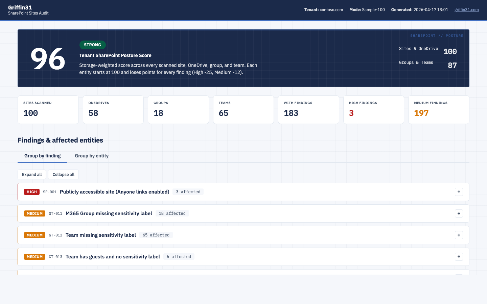

# SharePoint-Sites-Audit

> **Find the risky sites, OneDrives, groups, and teams** — 14 per-entity security checks, self-contained HTML report with drill-down findings.

<sub>[← Back to Griffin31 ToolKit](../)</sub>

<p align="center">
  
</p>

---

## What you get

- **Tenant SharePoint posture score** (0-100), storage-weighted across entities
- **14 per-entity security checks** — public sharing, anonymous access, excessive external users, inactive sites, missing sensitivity labels, and more
- **Two views in one report** — group by finding type (what problem affects how many?) or group by entity (what's wrong with this site?)
- **Entity table with filters** by type — Sites / OneDrive / Groups / Teams
- **Admin portal deep-links** per entity (plus a secondary link to the entity itself)
- **Cross-platform** — runs on Windows, macOS, Linux
- **Silent subsequent runs** — cert-based app-only auth after one-time setup

## Quick start

```powershell
pwsh ./SPO-Manager.ps1
```

First run: tool auto-triggers setup (Global Admin consent → cert generation → done in ~30s). Every subsequent run: silent cert auth, no prompts.

Menu: (1) Export only — (2) Analyze existing data — (3) Full pipeline Sample (top 100 sites) — (4) Full scan all sites.

## What it checks

14 API-detectable checks. Anything not detectable via API is intentionally dropped — no "review required" placeholders.

**Sites (8 checks)**
- Publicly accessible sites (Anyone-link sharing enabled)
- Sites allowing anonymous access
- Excessive external users on a site
- Site sharing more permissive than tenant baseline
- Inactive sites (no content changes > 365 days)
- Sites with missing or system-only admin
- Site missing a sensitivity label
- External users on non-group sites (likely direct grants)

**OneDrive (2 checks)**
- OneDrive accounts with excessive external sharing
- OneDrive sharing more permissive than tenant baseline

**Groups / Teams (3 checks)**
- M365 group missing sensitivity label
- Team missing sensitivity label
- Group or team with guest members and no sensitivity label

**Document libraries (1 check)**
- Default sensitivity label not configured on library

## Why this tool?

The SharePoint admin center shows you aggregate numbers — 4,200 sites, 18,000 external shares — but not *which specific sites* are the problem. Finding the 12 publicly-shared sites hiding in a 4,000-site tenant, or the Teams missing sensitivity labels, takes hours of clicking.

This tool iterates every site, OneDrive, M365 group, and Team, runs 14 API-detectable security checks, and produces a ranked HTML report. Sample mode scans the top 100 sites by storage in under 3 minutes; full-scan mode iterates every site.

## Requirements

- PowerShell 7.x (Windows, macOS, or Linux)
- `PnP.PowerShell` module — auto-installs if missing (cross-platform, modern auth)
- `Microsoft.Graph` module — auto-installs if missing
- **Role**: Global Administrator ONCE (first-run setup); SharePoint Administrator for subsequent runs

## First-time setup (auto, once per tenant)

On first run the tool registers its own Entra ID app — no manual portal work. It prompts you to sign in as Global Admin, generates a self-signed certificate on your machine, creates the app via Graph API, uploads the cert's public key, and grants app-only permissions. Config (ClientId + cert + encrypted password) is saved to `tenants/<domain>/config.json`.

**Every subsequent run is silent** — cert auto-authenticates. No browser, no sign-in prompt, no client secret.

<details>
<summary>App-only permissions requested (click to expand)</summary>

- Microsoft Graph (Application): `Group.Read.All`, `Directory.Read.All`, `InformationProtectionPolicy.Read.All`, `Sites.Read.All`
- SharePoint (Application): `Sites.FullControl.All`, `User.Read.All`

</details>

## How it works

Pipeline runs six stages, each writing JSON to `tenants/<domain>/data/`:

1. **Export-Data** — pulls sites, OneDrive accounts, groups, teams, labels (PnP + Graph)
2. **Analyze-Sites** — 8 per-site checks
3. **Analyze-OneDrive** — 2 per-OneDrive checks
4. **Analyze-GroupsTeams** — 3 per-group/team checks
5. **Analyze-KeyInsights** — per-entity scores + tenant roll-up
6. **Generate-Report** — self-contained HTML

## Output

- `tenants/<domain>/data/` — JSON per stage
- `tenants/<domain>/reports/SP_Sites_Audit_<timestamp>.html` — the report

Report includes: posture score hero, KPI row, group-by-finding view (collapsed by default — click to expand affected entities), group-by-entity table (DataTables with filters), admin-portal deep-links.

## Safety

- **Audit-only.** No remediation, no writes.
- **Read scopes only** plus SharePoint `Sites.FullControl.All` (PnP needs it to query site sharing caps — still read-only in practice).
- **No telemetry.** Data stays on your machine.
- **Tenant folder gitignored.**

## Honest limitations

- **Tenant-level config out of scope.** For tenant-wide settings (custom scripting, default link type, DLP, retention) use the SharePoint admin center.
- **Manual-only items dropped.** Anything not detectable via API (3rd-party backup, Purview DLP policies) is intentionally not covered.
- **Per-site external user counts** are aggregate (from `Get-PnPExternalUser`), not per-site exact counts — accurate at tenant level, approximate per site.
- **`tenants/<domain>/config.json` is machine-bound.** The cert password inside is encrypted via `ConvertFrom-SecureString` — DPAPI on Windows, per-user AES on macOS/Linux. You cannot copy the config (or the PFX) between machines or user accounts. On a new machine / user, delete the tenant folder and re-run setup.
- **macOS/Linux security caveat.** On Windows, DPAPI ties the encrypted cert password to your user SID and ties key material into the user profile. On macOS/Linux, PowerShell 7 derives the encryption key from a fixed file under `~/.local/share/powershell/` that's readable by the same user — so anyone (or any process) running as you can decrypt the PFX. The PFX itself grants `Sites.FullControl.All` across your tenant. Mitigations: use full-disk encryption, don't run this tool on a shared user account, and rely on the `chmod 600` the tool applies to config.json and the PFX.
- **App uses `Sites.FullControl.All`** — Microsoft does not honor a read-only variant for the SharePoint admin endpoints this tool calls (`Get-PnPTenantSite -Detailed`, `Get-PnPExternalUser`). The tool only ever reads; the broad permission is a Microsoft API limitation, not a tool design choice. Consider this before approving consent.
- **Azure AD tokens cache for ~1 hour.** If you delete the Entra app in the portal, the tool may still run successfully for up to an hour afterwards — the previously-issued access token is still cryptographically valid. This is Azure AD behaviour, not a tool bug. After the token expires, the next run detects the missing app and auto-triggers re-setup.

## Related tools

- [Entra-AppCredentials-Audit](../Entra-AppCredentials-Audit/) — audit apps that may access SharePoint
- [CA-Policy-Analyzer](../CA-Policy-Analyzer/) — companion posture report for Conditional Access
